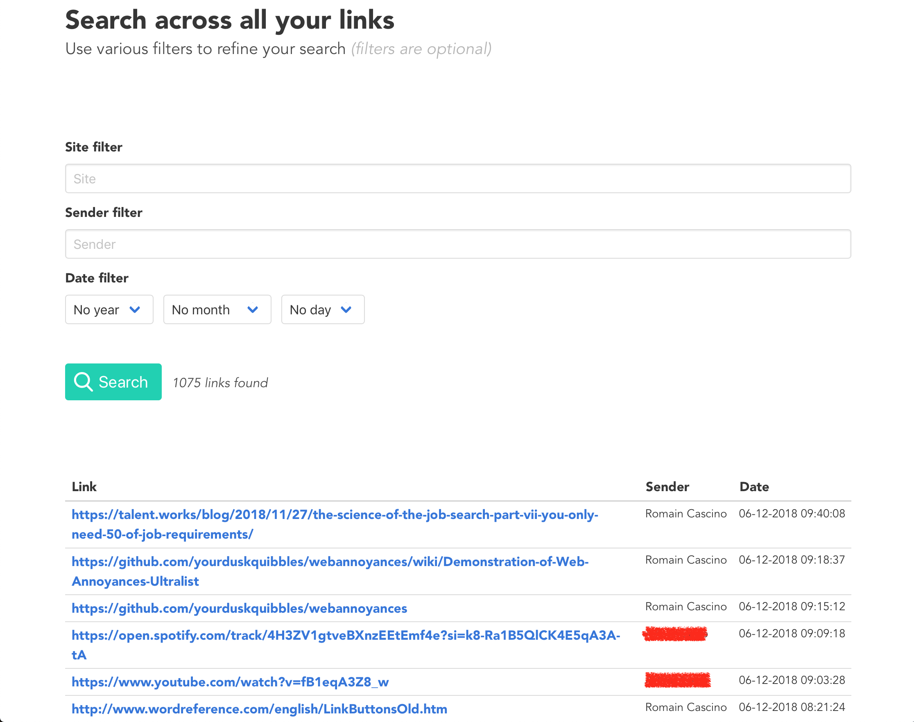

# messenger-parser-client

A client built in Vue.js for the [messenger links parser server](https://github.com/RomainCscn/messenger-links-parser).

This client let you search for the links you sent across Facebook Messenger, using various filters (sender, site or date). It also displays statistics about your links sending.

## How to use it

### Local

To locally run the project, use `npm run serve`.

Don't forget to run the [server](https://github.com/RomainCscn/messenger-links-parser#server).

### Hosting and online usage

You can host this project and use it online. Run the build command `npm run build`.

Put the `dist/`content on any hosting platform or your own server. The generated files are static so you can use Netlify for a free hosting, or even Github pages.

